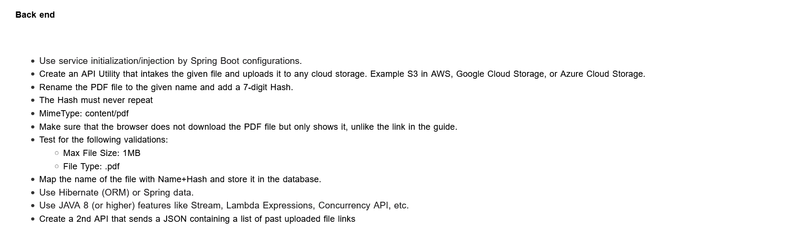

##### Upload PDF to Clod
###### A Basic project accepts pdf file and uploads it to S3 bucket

Requirements are something like mentioned in below image:


So there is a `GET` Method 
###
GET http://localhost:8080/pdf  
This will list down all files yet uploaded.  
Sample response: 
```json
[
  {
    "file_name": "dummyc4d1859-748029.pdf",
    "download_url": "https://pdf-s3-bablushaw904.s3.ap-south-1.amazonaws.com/dummyc4d1859-748029.pdf"
  }
]
```

###
POST http://localhost:8080/pdf with Request Body like `C:\Users\bs078474\Downloads\dummyc4d1859.pdf`  
This will upload the given file to S3

##### Tech-Stack:
My-SQL & Spring-boot. 

#### Properties
`mysql inputs`  
spring.datasource.url=jdbc:mysql://localhost/pdfUploadS3?useSSL=true  
spring.datasource.username=root  
spring.datasource.password=root123  

`aws inputs`  
aws.s3.accesskey=AKIAXXXXXXXXMFWI  
aws.s3.secretkey=IYrYtDuab8MchS3xXXXXXXXXXXXCKlk1MByX9F  
aws.s3.bucket_name=pdf-s3-bablushaw904  